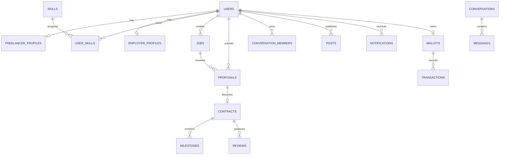

# مشخصات فنی Global Freelance Marketplace

**نسخه:** 0.1 — ۱۲ سپتامبر ۲۰۲۶  
**وضعیت:** تصویب معماری قبل از شروع پیاده‌سازی

## 1. تصمیم‌های معماری

### وضعیت فعلی مخزن
مخزن فعلی یک هسته‌ی PHP سفارشی MVC دارد (`app/`, `public/index.php`، مدل‌ها، کنترلرها، سرویس‌ها و migration SQL) و هنوز Laravel/Frontend/Admin UI کامل ندارد. بنابراین در Phase 1 ابتدا همین foundation را قابل اجرا، امن و تست‌پذیر می‌کنیم؛ بازنویسی فوری به Laravel انجام نمی‌دهیم، چون ریسک حذف قابلیت‌های فعلی و طولانی شدن تحویل را دارد.

### معماری هدف
- **Backend:** PHP 8.2+، لایه‌های Controller → Service → Repository/Model، REST API نسخه‌دار `/api/v1`.
- **Database:** PostgreSQL در production؛ MySQL 8 نیز قابل پشتیبانی. UUID/ULID برای شناسه‌های عمومی، migration versioned.
- **Cache/Queue:** Redis؛ queue برای email، notification، image processing و webhooks.
- **Storage:** S3-compatible private/public buckets؛ فایل‌ها با نام تصادفی و URL امضاشده.
- **Frontend:** React + TypeScript، RTL/LTR، طراحی responsive؛ در فاز اول می‌تواند داخل همین PHP app build و از `public/assets` سرو شود.
- **Admin:** مسیر و layout جدا (`/admin`) با RBAC، 2FA، audit log، navigation مستقل و تم لوکس.
- **Realtime:** WebSocket/Broadcast abstraction برای پیام‌ها و notification؛ fallback به polling.
- **Deployment:** Docker Compose (nginx، php-fpm، postgres، redis، worker، scheduler)، secrets از environment/secret manager.

## 2. اصول غیرقابل مذاکره

1. Controller بدون منطق کسب‌وکار؛ تمام use-caseها در Service.
2. تمام عملیات مالی idempotent و پشت `PaymentProviderInterface`؛ اطلاعات کارت ذخیره نمی‌شود.
3. Authorization در هر resource با Policy/Permission؛ فقط مخفی کردن دکمه کافی نیست.
4. هر تغییر حساس audit می‌شود.
5. آپلود: MIME واقعی، پسوند allow-list، حجم محدود، نام تصادفی، quarantine/scan hook، storage خارج از web root.
6. متن کاربر با escaping و CSP؛ CSRF برای session forms و rate-limit برای auth/API.
7. هیچ secret، credential، KYC یا raw payment data در source/database ذخیره نمی‌شود.
8. همه endpointها pagination، validation، consistent error envelope و request-id دارند.
9. زبان و ارز از configuration/catalog می‌آیند، نه hard-code.
10. تغییر schema فقط با migration و seed قابل تکرار.

## 3. مدل نقش و دسترسی

- Guest، Freelancer، Employer، Moderator، Support، Finance، Admin، Super Admin.
- Permission نمونه: `users.read`, `jobs.moderate`, `payments.refund`, `admin.audit.read`.
- نقش‌های admin جدا از نقش business؛ Super Admin قابل حذف/ویرایش توسط خود پنل نیست.
- Admin login: 2FA اجباری، session timeout، re-auth برای پرداخت/ban، ثبت IP/device و logout all sessions.

## 4. دامنه‌ها و ماژول‌ها

Auth & Sessions، Users & Profiles، Skills/Categories، Portfolio & Files، Jobs، Proposals، Contracts، Milestones/Deliverables، Messaging، Reviews/Reputation، Social، Notifications، Payments/Ledger، Verification، Reports/Moderation، Search، Admin، Settings/Privacy، Audit.

هر ماژول شامل Model/Repository، Service/use-cases، Policy، Request validation، API resource، migration و test است.

## 5. طرح داده نرمال‌شده

جداول اصلی:

- `users`, `roles`, `permissions`, `user_roles`, `sessions`, `password_resets`, `email_verifications`
- `profiles`, `freelancer_profiles`, `employer_profiles`, `companies`, `languages`, `user_languages`
- `skills`, `categories`, `user_skills`, `experiences`, `educations`, `certifications`
- `portfolios`, `portfolio_images`, `attachments`
- `jobs`, `job_skills`, `job_attachments`, `job_questions`, `saved_jobs`
- `proposals`, `proposal_milestones`, `proposal_attachments`
- `contracts`, `milestones`, `deliverables`, `contract_events`
- `conversations`, `conversation_members`, `messages`, `message_reads`, `message_reports`
- `reviews`, `review_dimensions`, `reputation_snapshots`
- `followers`, `posts`, `comments`, `likes`, `bookmarks`
- `notifications`, `notification_preferences`
- `reports`, `verifications`, `verification_events`
- `wallets`, `ledger_accounts`, `transactions`, `payment_intents`, `refunds`, `withdrawals`, `invoices`
- `audit_logs`, `admin_login_events`, `settings`, `consents`, `data_export_requests`

تمام جداول دارای `id`, `created_at`, `updated_at` هستند؛ soft-delete فقط برای محتوای مناسب آن (نه ledger/audit). Unique indexهای کلیدی: email، username، job slug، transaction provider reference، follow pair، review per contract/direction.

### ERD سطح بالا



## 6. API contract

Base: `/api/v1`; JSON envelope:

```json
{"data": {}, "meta": {"request_id":"..."}, "errors": []}
```

- `POST /auth/register`, `POST /auth/login`, `POST /auth/logout`, `POST /auth/forgot-password`, `POST /auth/verify-email`, `POST /auth/2fa/verify`
- `GET/PATCH /me`, `GET/PATCH /profiles/{username}`, `POST /profiles/{id}/follow`
- `GET /jobs`, `POST /jobs`, `GET/PATCH/DELETE /jobs/{slug}`, `POST /jobs/{id}/proposals`
- `GET /proposals`, `POST /proposals/{id}/shortlist|accept|reject`
- `GET /contracts`, `GET/PATCH /contracts/{id}`, `POST /contracts/{id}/milestones`
- `GET /conversations`, `GET/POST /conversations/{id}/messages`, `POST /messages/{id}/read`
- `GET/POST /portfolios`, `POST /portfolios/{id}/images`
- `GET/POST /posts`, `POST /posts/{id}/like|comments`
- `GET /notifications`, `POST /reports`, `GET/POST /reviews`
- `GET /search?type=freelancers|jobs|posts`
- `GET /admin/stats`, `/admin/users`, `/admin/jobs`, `/admin/reports`, `/admin/verifications`, `/admin/transactions`, `/admin/audit-logs`

خطاها: `401` authentication، `403` authorization، `404` عدم افشای resource، `422` validation، `429` rate limit، `409` state conflict.

## 7. صفحات و UX

Public: `/`, `/jobs`, `/jobs/{slug}`, `/freelancers`, `/freelancer/{username}`, `/portfolio/{slug}`, `/community`, `/post/{id}`, `/login`, `/register`, `/forgot-password`, `/verify-email`.

App: `/dashboard`, `/dashboard/profile`, `/dashboard/portfolio`, `/dashboard/jobs`, `/dashboard/proposals`, `/dashboard/contracts`, `/dashboard/messages`, `/dashboard/settings`, `/messages`, `/contracts`, `/notifications`.

Admin pages جدا: `/admin`, `/admin/users`, `/admin/jobs`, `/admin/proposals`, `/admin/contracts`, `/admin/payments`, `/admin/disputes`, `/admin/reports`, `/admin/reviews`, `/admin/skills`, `/admin/categories`, `/admin/posts`, `/admin/verifications`, `/admin/notifications`, `/admin/audit-logs`, `/admin/settings`.

### تم Admin لوکس
- پس‌زمینه ink/navy، کارت‌های graphite، accent طلایی کنترل‌شده، typography خوانا و contrast قابل قبول.
- Sidebar ثابت با collapse، topbar با command search، اعلان، profile و وضعیت سیستم.
- Dashboard با KPI cards، نمودار درآمد/رشد، queueهای نیازمند اقدام، activity timeline و quick actions.
- جدول‌ها: filter، search، column visibility، bulk action، export، empty/loading/error state.
- dark-first اما با رعایت WCAG AA؛ responsive برای تبلت و موبایل؛ بدون وابستگی به CDN در preview.

## 8. پرداخت، اختلاف و reputation

`PaymentProviderInterface`: `authorize`, `capture`, `refund`, `payout`, `verifyWebhook`; provider adapter قابل تعویض و webhook با signature verification و idempotency key.

Ledger دوطرفه و immutable است؛ refund/fee/withdrawal با transaction مجزا. اختلاف، hold و KYC فقط از طریق provider قانونی و policy jurisdiction انجام می‌شود.

Reputation configurable است: rating weighted، completion، on-time، response، dispute و verification؛ نسخه الگوریتم و snapshot ذخیره می‌شود تا امتیاز گذشته قابل توضیح باشد.

## 9. امنیت و حریم خصوصی

Argon2id، secure/HttpOnly/SameSite cookies، session rotation، HSTS در production، CSP، security headers، input validation، prepared statements، SSRF-safe URL fetch، upload limits، malware-scan adapter، rate-limit مجزا برای login/reset/message، login anomaly event، RBAC/Policy، audit trail.

GDPR/privacy: consent versioning، export، delete/anonymize، retention job، privacy settings و عدم ذخیره داده KYC/payment حساس در سیستم.

## 10. تست و کیفیت

- Unit: serviceها، reputation، money/ledger، policyها.
- Feature/API: auth، RBAC، jobs/proposals، contract state machine، upload، webhook idempotency.
- Integration: PostgreSQL/Redis و storage adapter.
- E2E smoke: register → profile → job → proposal → accept → contract → milestone → review.
- Static analysis، formatter/linter، dependency audit، security headers scan، migration-from-empty test.
- معیار تحویل هر فاز: test سبز، security review، migration قابل تکرار، docs به‌روز، no known critical/high issue.

## 11. فازبندی اجرایی

1. **Architecture + Database:** bootstrap، env، migrations، seed، ERD، error handling، health checks.
2. **Authentication + Users:** register/login/verification/password/2FA/session/RBAC.
3. **Profiles + Portfolio:** profile/resume/skills/files/public SEO pages.
4. **Jobs + Proposals:** create/publish/search/filter/apply/shortlist/accept.
5. **Contracts + Milestones:** state machine، deliverables، dispute foundation.
6. **Messaging:** conversations، attachments، read/typing/presence abstraction.
7. **Reviews + Reputation:** verified reviews، dimensions، configurable score.
8. **Social:** posts/follow/like/comment/report/feed.
9. **Payments Architecture:** provider interface، wallet/ledger، transaction/invoice/webhook.
10. **Admin:** luxury dashboard، moderation، verification، finance، audit.
11. **Security hardening:** threat model، headers، rate limits، upload scan، privacy jobs.
12. **Testing:** unit/feature/API/E2E، coverage baseline.
13. **Docker + CI/CD:** compose، worker، scheduler، GitHub Actions، scans.
14. **Production deployment:** nginx/SSL/secrets/backup/monitoring/runbooks.

## 12. موارد ضروری تکمیل‌شده نسبت به فهرست اولیه

- State machine و optimistic locking برای proposal/contract/milestone.
- Idempotency و reconciliation برای پرداخت و webhook.
- Outbox/event pattern برای notification قابل اعتماد.
- Object-level authorization و جلوگیری از IDOR.
- Backup restore drill، health/readiness checks و structured logging.
- Data retention، consent، export/anonymization و legal acceptance versioning.
- Accessibility، auditability، feature flags و observability (metrics/traces).
- Moderation queue، content status و appeal workflow.
- Disaster recovery و migration rollback policy.

## 13. معیار پذیرش اولیه

نسخه اول زمانی قابل ارائه است که کاربر بتواند ثبت‌نام/ورود کند، پروفایل و portfolio بسازد، کارفرما job منتشر کند، فریلنسر proposal بفرستد، proposal به contract تبدیل شود، milestone و پیام ایجاد شود، review ثبت شود و Admin همه این جریان‌ها را با RBAC، audit و تم حرفه‌ای مشاهده/مدیریت کند؛ و تمام این مسیر از migration خالی با تست‌های خودکار اجرا شود.
